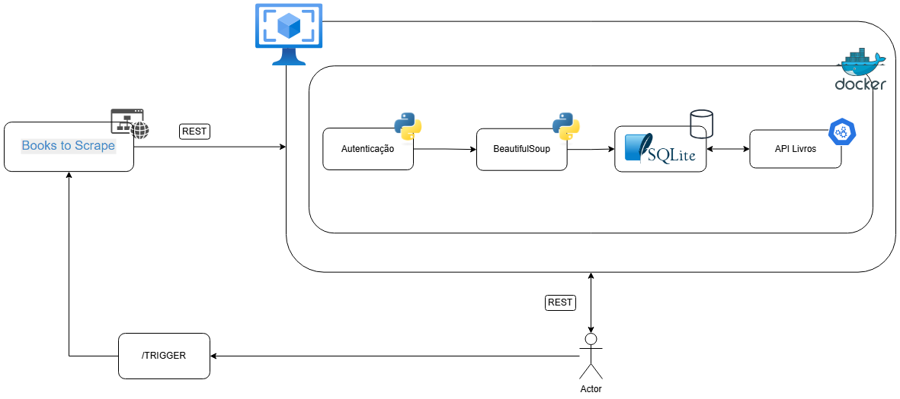

# Project Description

# Start Service

The main goal of this project is to extract book data from the website "Books to Scrape" (https://books.toscrape.com/index.html) using web scraping techniques and make this information available to end users through a secure RESTful API.

The application is designed with the following objectives:

- Web Scraping: Automatically collect data such as book titles, prices, ratings, and availability from the target website.

- Database Storage: Store the scraped data in a structured format using a relational database for efficient querying and retrieval.

- Secure API Endpoints: Develop RESTful endpoints to allow users to retrieve the stored data.

- User Authentication: Implement user registration and authentication mechanisms using tokens (e.g., JWT) to ensure only authorized users can access the API endpoints.

- Application Security: Protect the backend from unauthorized access and potential misuse by enforcing authentication on all critical routes.

This project combines backend development, data extraction, and security best practices, making it a robust example of how to integrate data collection with secure data exposure in real-world applications.

## Architecture



## Flow Description

1. **User Authentication**: The actor (user) must register and log in to the system to receive a JWT token.
2. **Triggering Scraping**: After authentication, the user can call the `/trigger` endpoint to start the scraping process.
3. **Scraping**: The system sends HTTP requests to the target site (`Books to Scrape`) and uses `BeautifulSoup` to extract structured book data from the HTML.
4. **Database Storage**: The data is saved in a local SQLite database for fast retrieval and persistence.
5. **Secure API Access**: The application exposes RESTful endpoints (e.g., `/books`, `/books/{id}`), which return the stored data to authenticated users.
6. **Docker Containerization**: The entire application runs inside a Docker container, ensuring environment consistency and easy deployment.

## Step 1 - Create environment

- Install requirements:

```bash
pip install -r requirements.txt
```

- Create a `.env` file in the project root.
- Copy all variables from `.env.example` and change the values as needed for your environment.
- Initialize the environment

```bash
venv\Scripts\activate
```

## Step 2 - Start local service

1. Run service with main method

```bash
python main.py
```

2. Run service using uvicorn

```bash
uvicorn "app:app" --host "0.0.0.0" --port "8000" --reload
```

## Step 3 - Send requests

Go to the fastapi docs and use your api endpoints - http://127.0.0.1/docs

# Project Structure and Contribution Guidelines

## Code linting and formatting

To ensure code quality and consistency, run the following script from the project root:

```bash
./lint.sh
```

This script will:

- Format your code using **Black**
- Run **pylint** to check for code issues

Make sure to run this script before committing your changes.

## Commit message convention

Use the following commit message prefixes to standardize your commits:

- **fix:** message describing a bug fix  
  _Example:_ `fix: correct book category parsing`

- **refactor:** message describing a code refactor  
  _Example:_ `refactor: improve scraping service structure`

- **config:** message describing configuration changes  
  _Example:_ `config: update .env example and logging config`

- **doc:** message describing documentation changes  
  _Example:_ `doc: update README with usage instructions`

- **feat:** message describing a new feature or implementation  
  _Example:_ `feat: add endpoint for book search`

## API Reference

### Authentication

| Method | Endpoint              | Description             |
| ------ | --------------------- | ----------------------- |
| POST   | `/api/v1/auth/signup` | Create a new user       |
| POST   | `/api/v1/auth/login`  | Login and get JWT token |

### Book Endpoints

| Method | Endpoint                    | Description                     |
| ------ | --------------------------- | ------------------------------- |
| GET    | `/api/v1/books`             | List all books                  |
| GET    | `/api/v1/books/{id}`        | Get book by ID                  |
| GET    | `/api/v1/books/top-rated`   | List top-rated books            |
| GET    | `/api/v1/books/price-range` | List books within a price range |
| GET    | `/api/v1/books/search`      | Search books by keyword         |

### Categories & Statistics Endpoints

| Method | Endpoint                   | Description                     |
| ------ | -------------------------- | ------------------------------- |
| GET    | `/api/v1/categories`       | List all book categories        |
| GET    | `/api/v1/stats/overview`   | Get general statistics overview |
| GET    | `/api/v1/stats/categories` | Get book count per category     |

### Scraping Endpoint

| Method | Endpoint                   | Description                    |
| ------ | -------------------------- | ------------------------------ |
| POST   | `/api/v1/scraping/trigger` | Trigger a new scraping process |

### Health Check Endpoint

| Method | Endpoint               | Description      |
| ------ | ---------------------- | ---------------- |
| GET    | `/api/v1/health/check` | Check API status |

### Machine Learning Endpoints

| Method | Endpoint                   | Description                 |
| ------ | -------------------------- | --------------------------- |
| GET    | `/api/v1/ml/features`      | Formatted data for features |
| GET    | `/api/v1/ml/training-data` | Training dataset            |
| GET    | `/api/v1/ml/predictions`   | Prediction endpoint         |

## Exemplos de Requisições e Respostas

### Signup (criar usuário)

- Request

```bash
curl -X 'POST' \
  'http://localhost:8000/api/v1/auth/signup' \
  -H 'accept: application/json' \
  -H 'Content-Type: application/json' \
  -d '{
  "email": "user@example.com",
  "name": "string",
  "password": "string",
  "role": "REGULAR"
}'
```

- Response

```bash
[
  {
    "email": "user2@example.com",
    "name": "string2",
    "role": "REGULAR",
    "message": "User created successfully"
  },
  201
]
```

### Login (obter token JWT)

- Request

```bash
curl -X 'POST' \
  'http://localhost:8000/api/v1/auth/login' \
  -H 'accept: application/json' \
  -H 'Content-Type: application/json' \
  -d '{
  "email": "user@example.com",
  "password": "string"
}'
```

- Response

```bash
[
  {
    "access_token": "eyJhb...",
    "token_type": "bearer"
  },
  200
]
```

### Listar todos os livros

- Request

```bash
curl -X 'GET' \
  'http://localhost:8000/api/v1/books' \
  -H 'accept: application/json' \
  -H 'Authorization: Bearer ey...'
```

- Response

```bash
[
  {
    "id": 1,
    "category": "Poetry",
    "price_excl_tax": 51.77,
    "tax": 0,
    "reviews_qtd": 0,
    "image": "https://books.toscrape.com/media/cache/fe/72/fe72f0532301ec28892ae79a629a293c.jpg",
    "rating": 3,
    "uuid": "a897fe39b1053632",
    "title": "A Light in the Attic",
    "price_incl_tax": 51.77,
    "availability": 22,
    "description": "It's hard to..."
  }
]
```

### Buscar livros por faixa de preço

- Request

```bash
curl -X 'GET' \
  'http://localhost:8000/api/v1/books/price-range?min_price=1&max_price=20' \
  -H 'accept: application/json' \
  -H 'Authorization: Bearer eyJhb...'
```

- Response

```bash
[
  {
    "id": 11,
    "category": "Default",
    "price_excl_tax": 13.99,
    "tax": 0,
    "reviews_qtd": 0,
    "image": "https://books.toscrape.com/media/cache/a0/7e/a07ed8f1c23f7b4baf7102722680bd30.jpg",
    "rating": 2,
    "uuid": "0312262ecafa5a40",
    "title": "Starving Hearts (Triangular Trade Trilogy, #1)",
    "price_incl_tax": 13.99,
    "availability": 19,
    "description": "Since her assault, ..."
  }
]
```
